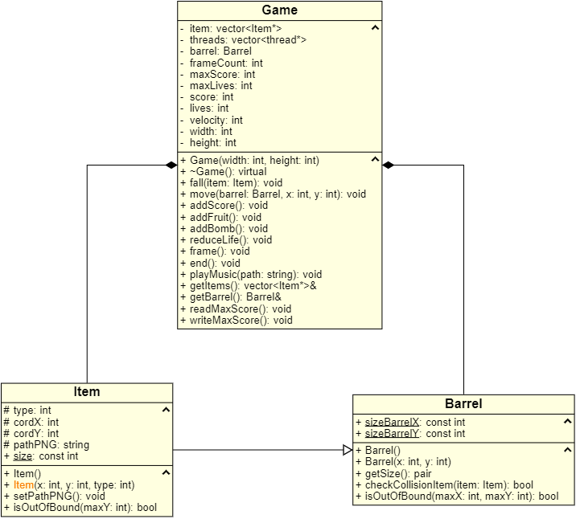

<h1 align="center">Frutinha</h1>

Projeto realizado para a disciplina de linguagem de programação I, feito utilizando a biblioteca OpenCV e Programação orientada a Objetos. Se trata de um jogo
onde o jogador possui três vidas e deve pegar o máximo de frutinhas possível para alcançar uma maior pontuação. Se a sua pontuação for a maior seu recorde será salvo no arquivo do programa.

A seguir temos a imagem do diagrama de classes do projeto: 

  

